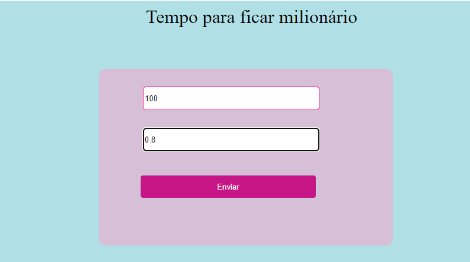
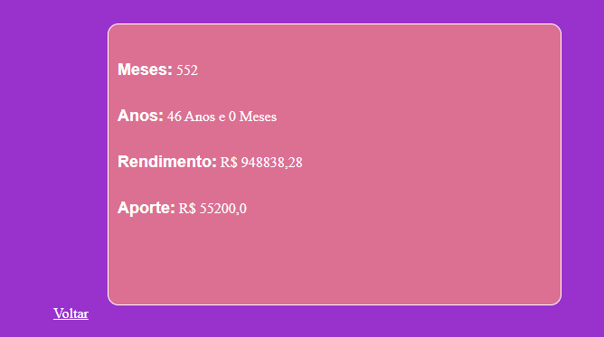

# JurosCompostos 💰

<h1>Description and Funcionalities :books:</h1>
This project has the objective of calculating how long a person will become a millionaire, through
a monthly contribution and the interest that will be applied on interest. This project was developed in:

<ul>
  <li>HTML</li>
   <li>CSS</li>
   <li>Java</li>

</ul

<h1>How to use :books:</h1>
To open this project on your machine it is necessary to have the Java SDK installed and some IDE, 
such as Eclipse, IntelliJ IDEA or NetBeans. Download it, configure it on the machine and open the files, 
must be configured for the web and on a server.

<h1>Funcionalities</h1>

<h1>Authors</h1>
Giovanna Cruz dos Santos(only me)

